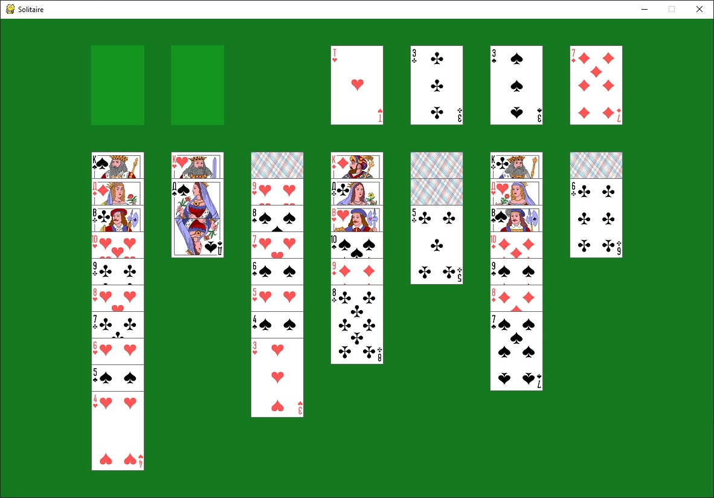
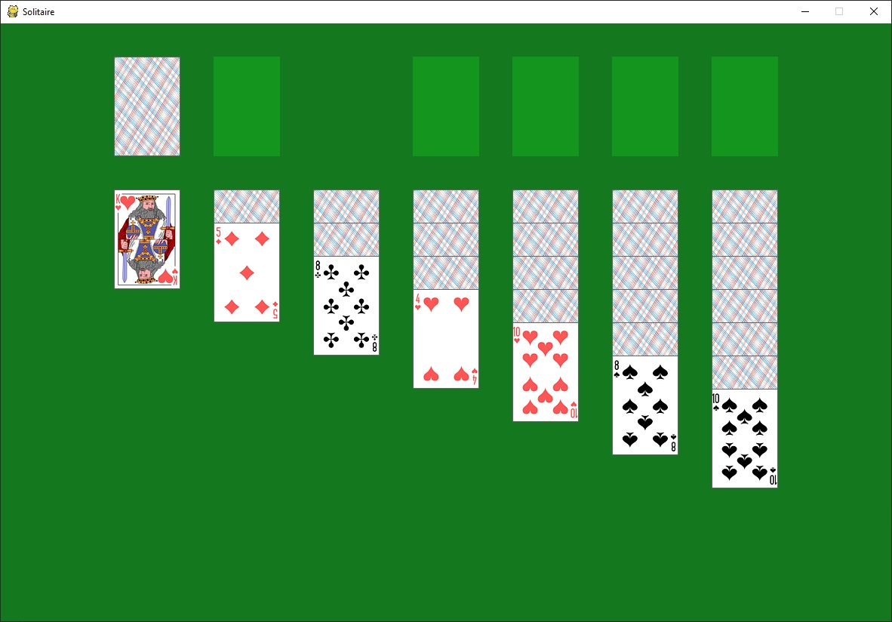
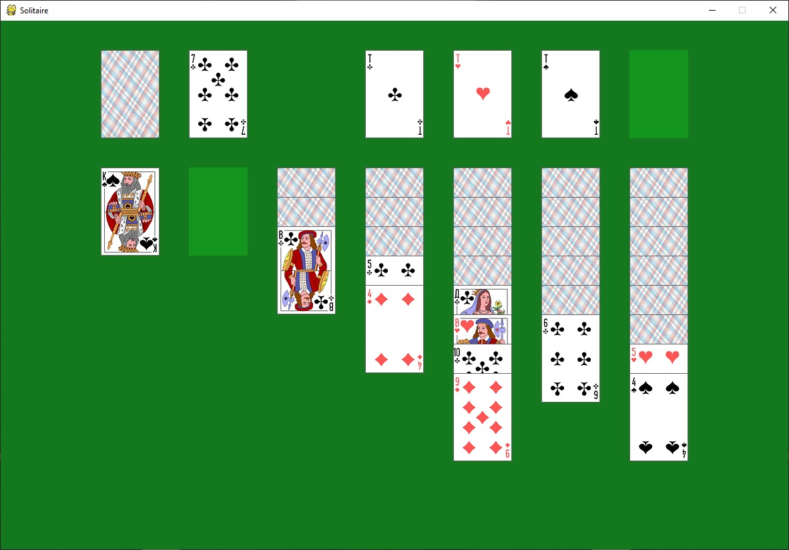

# Solitaire
Пасьянс Косынка

Пасьянс Косынка из стандартного набора игр Windows, реализованный с помощью Python и pygame. Для запуска игры надо запустить файл start.pyw. Во время игры в любой момент можно нажать пробел и компьютер соберет карты с игрового поля и раздаст новую раскладку.
Разделение на файлы уже традиционное для моих игр: start - файл для запуска (содержит инициализирующий код и игровой цикл), functions - вспомогательные функции (например, функции отрисовки объектов), classes - вспомогательные классы (например, для представления отдельных карт или колоды), settings - параметры работы программы (например, высота/ширина окна, путь к папке с ресурсами, цветовые константы и т.д.)

Отдельно немного расскажу о написанных классах, так как основной объем логики реализован именно в них.
Класс Card - представляет отдельные карты
Класс Deck - представляет колоду карт в целом
Класс Storage - "хранилище", в которое карты попадают при щелчке мышью по колоде. Из хранилища игрок непосредственно берет карты.
Класс WorkPool - цепочки, в которых игрок манипулирует картами, перемещая их из одной цепочки в другую
Класс FinalPool - цепочки, которые должны быть полностью собраны игроком (все карты от туза до короля одной и той же масти), чтобы пасьянс сошелся
Класс Animation - с помощью него реализована анимация перемещения карт. При создании экземпляра этого класса ему передается карта, место, в которое ее надо переместить и дополнительное действие, которое нужно совершить по завершении анимации (перевернуть карту, добавить карту в пул). Одновременно могут проигрываться сразу несколько анимаций, добавленные в специальный список.
Класс Drag - нужет для реализации операций dran'n'drop с картами. Три его основных метода - accept, move и drop. Метод accept выбирает, из какого места игрок берет карты, метод move перемещает взятые карты в окне вслед за движением мыши, метод drop - определяет, куда игрок хочет опустить карты и можно ли по правилам игры это сделать (в зависимости от результата он запускает либо анимацию опускания карт, либо анимацию возврата карт на исходное место)

